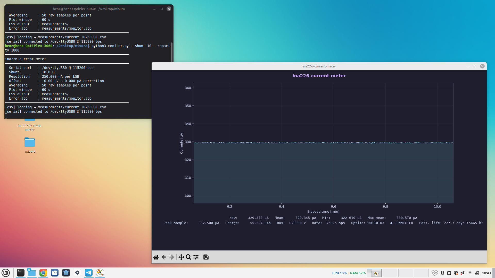
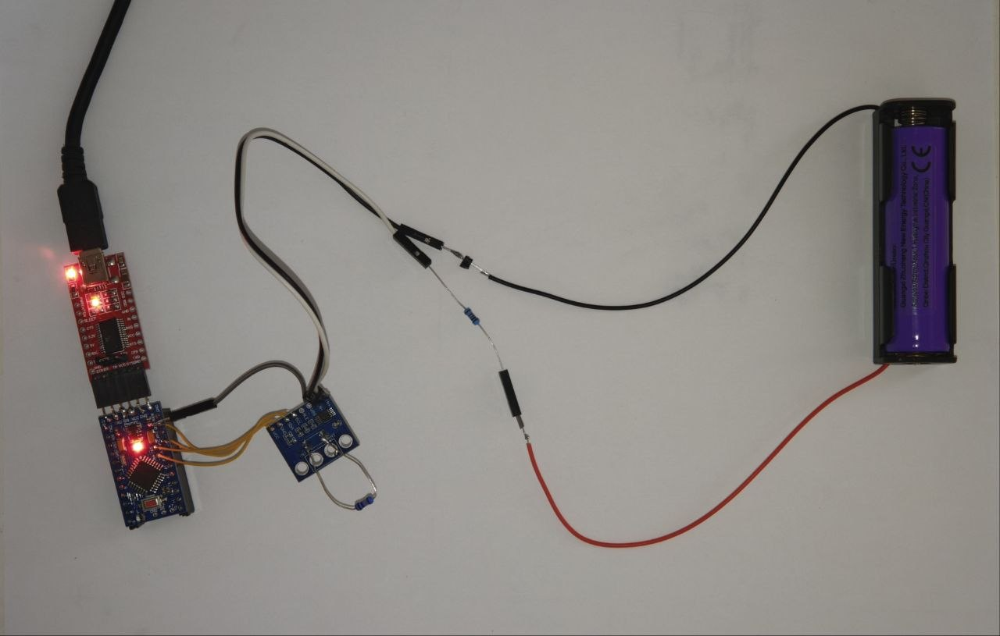
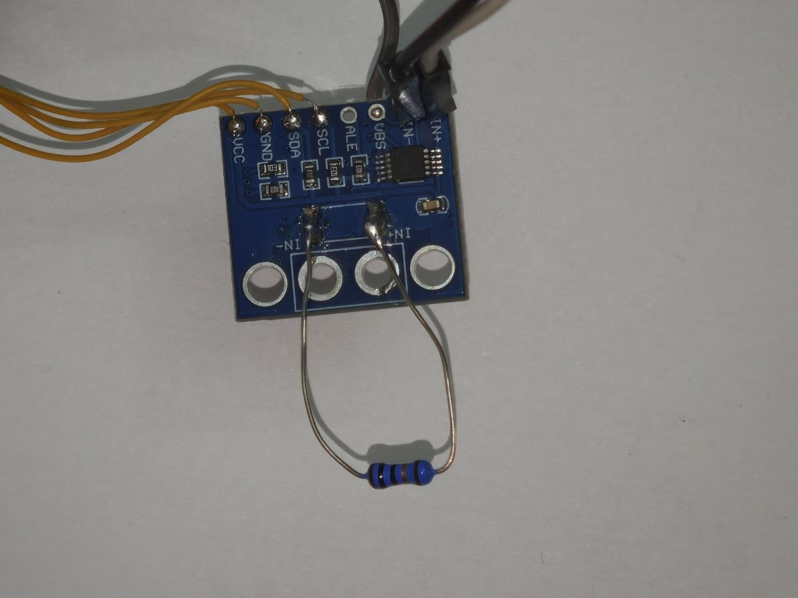
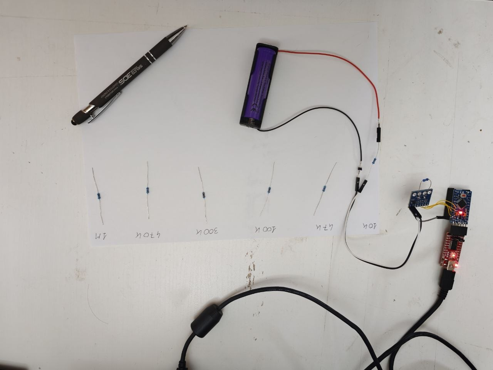

# ina226-current-meter

Real-time current monitor for low-power devices. Reads INA226 samples from an Arduino over serial, averages them, plots live data, and logs everything to daily CSV files.

Built to characterise the sleep and active consumption of a battery-powered ESP32-C3 device, and verified against precision resistors down to single-digit microamperes.



## How it works

```
[Device under test]
       │
   [Shunt R]  ←── INA226 reads differential voltage across shunt
       │
  [INA226] ──I2C──► [Arduino] ──Serial 115200 bps──► [This script]
```

The Arduino configures the INA226, polls its registers and streams raw values over serial. The Python script does all the processing: unit conversion, live plotting, charge integration, and CSV logging.



## Firmware

The Arduino sketch (`firmware/misura_corrente.ino`) is deliberately minimal: it configures the INA226 once and then streams raw register values. All scaling and interpretation happens on the host, so the shunt value can be changed without reflashing.

### Hardware connections

| INA226 breakout | Arduino Pro Mini |
|-----------------|------------------|
| VCC             | VCC (3.3 V or 5 V, match your board) |
| GND             | GND              |
| SDA             | A4               |
| SCL             | A5               |
| IN+ / IN−       | across the shunt resistor, in series with the device under test |

I²C address is `0x40` (A0/A1 both tied to GND). The bus runs at 400 kHz.



The shunt is soldered directly across the IN+ / IN− pads, replacing the 0.1 Ω resistor fitted on the breakout.

### Configuration register

```c
ina226Write(REG_CONFIG, 0x4E07);
```

`0x4E07` decodes as:

| Bits  | Field   | Value | Meaning |
|-------|---------|-------|---------|
| 15    | RST     | 0     | no reset |
| 14–12 | —       | 100   | fixed  |
| 11–9  | AVG     | 111   | 1024 internal samples averaged |
| 8–6   | VBUSCT  | 000   | 140 µs bus conversion time |
| 5–3   | VSHCT   | 000   | 140 µs shunt conversion time |
| 2–0   | MODE    | 111   | shunt and bus, continuous |

### Sampling rate — read this before trusting the numbers

In continuous shunt-and-bus mode the INA226 completes one conversion every:

```
t_conv = AVG × (VSHCT + VBUSCT)
       = 1024 × (140 µs + 140 µs)
       = 287 ms
```

**The device therefore produces a new value about 3.5 times per second.** The Arduino loop polls the registers far faster than that, so most serial lines repeat the previous conversion result. The rate reported by the host script is a *polling* rate, not a sampling rate.

Two consequences worth being explicit about:

- **Noise averaging happens inside the INA226, not on the host.** With AVG = 1024 the part already averages 1024 internal conversions, which is why the traces are so flat. Averaging duplicated lines on the PC adds nothing; the `--avg` option only reduces plotting and logging volume.
- **Fast transients are invisible at this setting.** An e-ink refresh lasting tens of milliseconds falls entirely inside one 287 ms conversion window and is averaged away. `peak_sample_A` cannot resolve it.

### Choosing AVG for the measurement you want

With both conversion times at 140 µs:

| AVG  | CONFIG | t_conv  | Updates/s | Noise vs AVG=1 | Use for |
|------|--------|---------|-----------|----------------|---------|
| 1    | 0x4007 | 280 µs  | ~3570     | ×1             | transients, current peaks |
| 4    | 0x4207 | 1.12 ms | ~890      | ÷2             | fast activity |
| 16   | 0x4407 | 4.48 ms | ~223      | ÷4             | general active-mode work |
| 64   | 0x4607 | 17.9 ms | ~56       | ÷8             | mixed profiles |
| 256  | 0x4A07 | 71.7 ms | ~14       | ÷16            | quiet averages |
| 1024 | 0x4E07 | 287 ms  | ~3.5      | ÷32            | **sleep current (default)** |

Use **AVG = 1024** to measure a stable sleep current to a fraction of a microampere, and drop to **AVG = 1 or 4** when the question is how much charge a wake-up burst costs. They are different measurements and need different settings.

### Serial bandwidth

At 115200 baud (8N1, 10 bits per byte) the link carries about 11.5 kB/s. A line such as `11783668144,11,2564\n` is roughly 21 bytes, so the physical ceiling is around **500 lines per second** regardless of how fast the loop runs. Raise the baud rate if you move to a low-AVG setting and want every conversion on the wire.

### Known rough edge

```c
return (Wire.read() << 8) | Wire.read();
```

The evaluation order of the two `Wire.read()` calls is unspecified before C++17, and the AVR core compiles as gnu++11. It works with the current toolchain but is not guaranteed; splitting it into two statements with named temporaries removes the risk.

## Serial data format

Each line is one poll of the INA226 registers:

```
micros,shunt,bus
```

| Field    | Type            | Description                              |
|----------|-----------------|------------------------------------------|
| `micros` | `unsigned long` | Arduino timestamp in µs (`micros()`)     |
| `shunt`  | `int16_t`       | Raw INA226 shunt register (LSB = 2.5 µV) |
| `bus`    | `int16_t`       | Raw INA226 bus register (LSB = 1.25 mV)  |

**Example line:**
```
11783668144,11,2564
```

This means:
- Timestamp: 11 783 668 144 µs since Arduino boot
- Shunt: 11 LSB × 2.5 µV = 27.5 µV across the shunt
- Bus voltage: 2564 LSB × 1.25 mV = 3.205 V

**Current calculation:**

```
I [A] = (shunt_raw × 2.5e-6) / R_shunt [Ω]
```

The script handles `int16_t` two's complement correctly, so negative values (reverse current) are displayed properly.

**Timestamp overflow:** Arduino's `micros()` wraps around every ~71.58 minutes on AVR boards (32-bit counter). The script detects and corrects this automatically. ARM-based boards with 64-bit counters are also supported.

## Shunt resistor selection

The shunt value is the most important parameter. The INA226 shunt register is 16-bit signed, giving a maximum differential input of:

```
V_shunt_max = 32767 × 2.5 µV = 81.92 mV
```

Everything else follows from that ceiling: a larger shunt buys resolution and costs full scale, in direct proportion.

| Shunt [Ω] | Resolution (1 LSB) | Full scale  | Verified |
|-----------|--------------------|-------------|----------|
| 0.1       | 25 µA              | 819.2 mA    | —        |
| 1         | 2.5 µA             | 81.92 mA    | ✓        |
| **10**    | **0.25 µA**        | **8.192 mA**| **✓**    |
| 100       | 0.025 µA = 25 nA   | 819.2 µA    | —        |

The recommended value for low-power device monitoring is **10 Ω** — see the accuracy section for the reason. Rows marked ✓ have been characterised on hardware; the others are derived from the same relationships.

### Full scale is a hard limit

Above full scale the ADC saturates: the reading stops tracking the current and no error is flagged. There is a second constraint that bites earlier in practice — the burden voltage. The shunt sits in series with the device under test, so it drops `I × R_shunt` out of the supply:

| Current | Drop across 10 Ω | Drop across 1 Ω |
|---------|------------------|-----------------|
| 300 µA  | 3 mV             | 0.3 mV          |
| 8 mA    | 80 mV            | 8 mV            |
| 40 mA   | 400 mV (out of range) | 40 mV      |

A device that sleeps at 300 µA and peaks at 40 mA during a display refresh therefore cannot be measured in one pass with a 10 Ω shunt: the peak is five times over range, and 400 mV of burden voltage is enough to brown out a 3.3 V target. Characterise sleep with 10 Ω, then swap to 1 Ω for the active phase.

## Requirements

```bash
pip install -r requirements.txt
sudo apt install python3-tk   # required for the live plot (TkAgg backend)
```

Grant serial port access (once, then log out/in or use `newgrp`):
```bash
sudo usermod -a -G dialout $USER
newgrp dialout
```

## Usage

```bash
python monitor.py [options]
```

### Options

| Option | Default | Description |
|--------|---------|-------------|
| `--port PORT` | `/dev/ttyUSB0` | Serial port |
| `--baud BAUD` | `115200` | Baud rate |
| `--shunt OHM` | `10.0` | Shunt resistor value in Ohm |
| `--offset UV` | `0.0` | Input-referred voltage offset correction in µV |
| `--avg N` | `50` | Serial lines combined per plotted point |
| `--window SEC` | `60` | Live plot time window in seconds |
| `--outdir DIR` | `measurements/` | Output directory for CSV files and log |
| `--capacity MAH` | _(none)_ | Battery capacity in mAh — enables battery life estimate |

`--shunt` must match the resistor actually fitted: a wrong value silently scales every reading.

### Examples

**Basic usage — 10 Ω shunt:**
```bash
python monitor.py --shunt 10
```

**With offset correction (−5 µV measured with shorted inputs):**
```bash
python monitor.py --shunt 10 --offset -5
```

**Active-mode measurement — 1 Ω shunt:**
```bash
python monitor.py --shunt 1
```

**With battery life estimate (2000 mAh pack):**
```bash
python monitor.py --shunt 10 --capacity 2000
```

**Wider plot window (5 minutes):**
```bash
python monitor.py --shunt 10 --window 300
```

**Different serial port (e.g. macOS or second USB adapter):**
```bash
python monitor.py --port /dev/ttyUSB1 --shunt 10
```

**0.1 Ω shunt for higher-current loads (full scale 819 mA):**
```bash
python monitor.py --shunt 0.1
```

**Run for weeks unattended inside tmux:**
```bash
tmux new -s meter
python monitor.py --shunt 10 --capacity 2000
# Detach: Ctrl+B then D
# Reattach later:
tmux attach -t meter
```

## Live plot


The plot window shows:

- **Current waveform** — auto-scaled axis (nA / µA / mA / A)
- **Time axis** — auto-scales from seconds → minutes → hours → days as the session grows

**Stats panel** (bottom of the window):

| Field | Description |
|-------|-------------|
| `Now` | Latest plotted value |
| `Mean` | Session average since start |
| `Min` / `Max mean` | Session extremes of the plotted points |
| `Peak sample` | Highest single line seen in the session (limited by the INA226 conversion time — see Firmware) |
| `Charge` | Total charge consumed since start (µAh / mAh) |
| `Bus` | Bus voltage read from INA226 |
| `Rate` | Serial polling rate (lines/s), **not** the INA226 conversion rate |
| `Uptime` | Time elapsed since start |
| `Batt. life` | Estimated battery life (only with `--capacity`) |

## Output files

All files are written to `--outdir` (default: `measurements/`).

### CSV — `current_YYYYMMDD.csv`

One file per day, rotating at midnight. Columns:

| Column | Description |
|--------|-------------|
| `wall_time` | ISO 8601 timestamp |
| `elapsed_s` | Seconds since session start |
| `current_A` | Current in Ampere |
| `peak_sample_A` | Max single line in the window |
| `bus_V` | Bus voltage in Volt |
| `charge_uAh` | Cumulative charge in µAh |
| `n_avg` | Number of serial lines in this point |
| `rate_sps` | Measured polling rate |

### Log — `monitor.log`

Rotating daily log (30-day retention). Records connections, disconnections, CSV rotations, and the full traceback of any crash — useful to diagnose unexpected exits.

```bash
tail -f measurements/monitor.log
```

## Accuracy measurements

Characterised against precision resistors as the load, supply 3.28 V, theoretical current computed as I = V / R. Each point is the reading after the value had settled.



Raw measurement data is in [`docs/measurements.ods`](docs/measurements.ods).

### 10 Ω shunt (recommended) — resolution 0.25 µA/LSB

| Load [Ω] | Theoretical [µA] | Measured [µA] | Error [µA] |
|----------|-----------------|---------------|------------|
| 10 000   | 328.00          | 329.4         | +1.4       |
| 47 000   | 69.79           | 69.3          | −0.5       |
| 100 000  | 32.80           | 32.8          | 0.0        |
| 300 000  | 10.93           | 10.5          | −0.4       |
| 470 000  | 6.98            | 6.53          | −0.5       |
| 1 000 000| 3.28            | 2.8           | −0.5       |

### 1 Ω shunt — resolution 2.5 µA/LSB

| Load [Ω] | Theoretical [µA] | Measured [µA] | Error [µA] |
|----------|-----------------|---------------|------------|
| 10 000   | 328.00          | 329.0         | +1.0       |
| 47 000   | 69.79           | 65.5          | −4.3       |
| 100 000  | 32.80           | 27.6          | −5.2       |
| 300 000  | 10.93           | 5.75          | −5.2       |
| 470 000  | 6.98            | 1.7           | −5.3       |
| 1 000 000| 3.28            | −2.0          | −5.3       |

### Understanding the errors

**The +1 µA point at 10 kΩ** appears in both tables and is the only positive error. This is not an instrument artifact — it is load resistor tolerance. A 10 kΩ at 1 % can deviate by ±100 Ω, which at 3.28 V translates to ±3.3 µA of theoretical uncertainty. Both +1.0 and +1.4 µA sit well inside that bound.

**The systematic negative offset** in the 1 Ω data (≈ −5.25 µA, stable across every point below 100 µA) is not a current-domain effect. It is an **input-referred voltage offset of approximately −5 µV** on the INA226 shunt amplifier. Because it is a voltage offset, its contribution to the current error scales inversely with the shunt resistance:

```
I_error = V_offset / R_shunt
−5 µV / 1 Ω  = −5.0 µA   ← matches the 1 Ω measurements
−5 µV / 10 Ω = −0.5 µA   ← matches the 10 Ω measurements
```

The same −5 µV appears in both datasets, expressed in different current units. This is why a **larger shunt suppresses the offset error**. The INA226 datasheet specifies a typical input offset of 2.5 µV and a maximum of 10 µV, so −5 µV is within spec for this part.

**Practical conclusion:** use 10 Ω for currents below ~1 mA. The −0.5 µA residual is roughly two LSB and can be removed with `--offset -5`. With 1 Ω the offset exceeds 5 % of the reading below about 100 µA, and by 33 µA it is already a 16 % error — so 1 Ω is a poor choice for sleep-current work, and the right choice above ~100 µA where the same 5 µA is negligible.

### Offset correction

To measure and remove the INA226 input offset:

1. **Short the INA226 shunt inputs together** (IN+ to IN−). This forces a true zero differential input, so whatever the device reads is the offset. Leaving the load disconnected is not equivalent — an open circuit leaves the inputs floating and the reading is not meaningful.
2. Run the monitor and note the reading — this is the offset expressed in current units for the shunt value currently configured.
3. Convert to µV: `V_offset [µV] = I_offset [µA] × R_shunt [Ω]`
4. Pass the result to `--offset`:

```bash
# Example: shorted-input reading = −0.5 µA with --shunt 10 → V_offset = −5 µV
python monitor.py --shunt 10 --offset -5
```

The correction is applied to every raw sample. Because the offset is a property of the INA226 and not of the shunt, one measurement is valid for every shunt value — expressed in µV it does not change.

### Improving the characterisation

The theoretical currents above assume nominal load resistances. Measuring each load resistor with a multimeter and recomputing `I = V / R_measured` removes the tolerance term and tightens the residuals, particularly at the 10 kΩ point where it dominates.

## Credits

Hardware, firmware, measurements and characterisation by Luca Benzi.
Host-side visualisation written in Python with AI assistance.

## License

MIT
